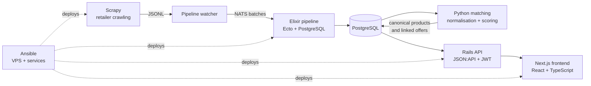
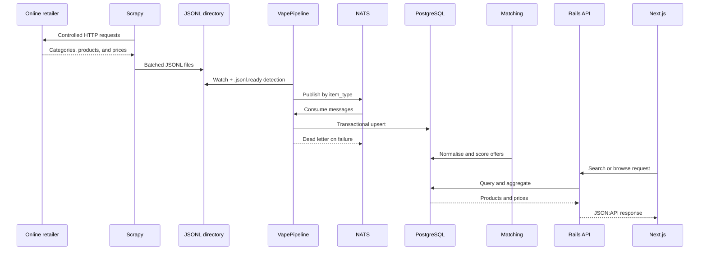

# Vapalape

[Version française](README.md) | **English version**: [README.en.md](README.en.md)

Vapalape is a price comparison platform dedicated to vaping products. The system collects catalogues from online retailers, links offers that refer to the same product, stores price history, and exposes the resulting data through an API and a web interface.

This repository is the public technical showcase for the project. The code is split into specialised repositories, documented from the [`back`](back/README.en.md), [`front`](front/README.en.md), [`infra`](infra/README.en.md), [`matching`](matching/README.en.md), [`pipeline`](pipeline/README.en.md), and [`scraper`](scraper/README.en.md) directories.

## Architecture



The data journey is:

1. The **Scrapy scraper** visits French e-commerce websites and exports structured items as JSONL files.
2. The **Elixir pipeline** watches an incoming directory, publishes items to NATS in batches, and persists them to PostgreSQL with Ecto.
3. The **Python matching service** normalises names, extracts attributes, and generates candidates across retailer offers.
4. The Rails API serves canonical products, prices, price histories, search results, and user features.
5. The Next.js frontend consumes the API to display search, product pages, price comparisons, alerts, and editorial content.
6. Ansible configures the VPS, services, security, and runtime processes.

## Components

| Directory | Main responsibility | Stack |
| --- | --- | --- |
| [`scraper`](scraper/README.en.md) | Multi-retailer crawling and item export | Python, Scrapy, PostgreSQL, proxies, and anti-blocking middleware |
| [`pipeline`](pipeline/README.en.md) | Reliable JSONL ingestion and event-based persistence | Elixir, OTP, Ecto, PostgreSQL, NATS |
| [`matching`](matching/README.en.md) | Entity resolution between offers and canonical products | Python, RapidFuzz, pg_trgm, pgvector, sentence-transformers |
| [`back`](back/README.en.md) | Business API and application services | Ruby, Rails API-only, PostgreSQL, JWT |
| [`front`](front/README.en.md) | Comparison interface and web content | Next.js, React, TypeScript, Tailwind CSS |
| [`infra`](infra/README.en.md) | VPS provisioning and operations | Ansible, Debian/Ubuntu, Nginx, systemd, Supervisor, PM2 |

## Ingestion flow



The pipeline protects the database from ingestion errors: messages are batched, NATS concurrency can be limited with `max_messages`, writes are routed by `item_type`, and failures are isolated in dead letters. Matching runs separately so its rules and scoring versions can evolve without changing the collectors.

## What the project demonstrates

- **Entity resolution**: the same physical product can have different names, attributes, and formats across retailers.
- **Data quality**: categories, brands, variants, prices, and histories are treated as domain data rather than raw HTML output.
- **Failure tolerance**: retries, NATS backpressure, supervised reconnection, dead letters, and deferred foreign-key reconciliation.
- **Product search**: full-text search, filters, facets, and SQL fallback when the external search service is unavailable.
- **Separation of responsibilities**: acquisition, ingestion, matching, exposure, and presentation are decoupled.
- **Operations**: deployment targets a VPS and automates system configuration, network security, web services, and workers.
- **Functional evolution**: price history, alerts, favourites, affiliate tracking, editorial content, an AI assistant, and market intelligence are exposed as separate capabilities.

## Repository layout

```text
.
├── README.md
├── README.en.md
├── scraper/    # Scrapy project documentation
├── pipeline/   # Elixir/NATS pipeline documentation
├── matching/   # Python matching documentation
├── back/       # Rails API documentation
├── front/      # Next.js frontend documentation
└── infra/      # VPS Ansible documentation
```

## Suggested reading order

To follow a data item through the system, start with [`scraper/README.en.md`](scraper/README.en.md), continue with [`pipeline/README.en.md`](pipeline/README.en.md), then read [`matching/README.en.md`](matching/README.en.md). For data consumption, read [`back/README.en.md`](back/README.en.md) followed by [`front/README.en.md`](front/README.en.md). The deployment and operations perspective is covered in [`infra/README.en.md`](infra/README.en.md).

Each local README also points to the corresponding code repository, main commands, and technical reference documents.
