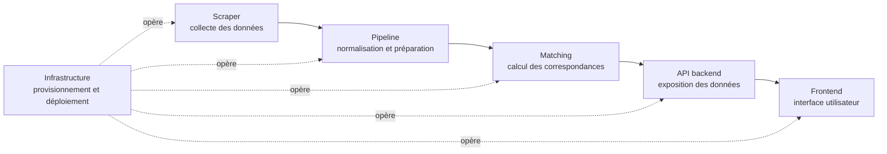
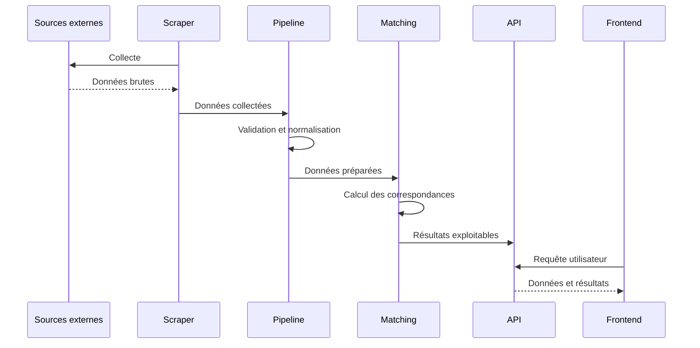

# Vapalape

Vapalape est un projet de plateforme de découverte et de mise en relation autour de lieux et d'activités. Ce dépôt est la vitrine technique du projet : il présente son architecture, ses responsabilités fonctionnelles et les dépôts qui composent le système.

L'objectif de ce repository est de permettre à un lecteur technique, notamment un recruteur, de comprendre rapidement comment les différents composants collaborent, où se trouvent les responsabilités et quels sujets d'ingénierie sont traités.

> Ce dépôt sert de carte d'architecture. Le code opérationnel est maintenu dans les dépôts dédiés référencés ci-dessous.

## Architecture



Le flux principal est volontairement séparé en plusieurs étapes :

1. Le **scraper** récupère des données depuis des sources externes.
2. Le **pipeline** transforme ces données pour les rendre cohérentes et exploitables.
3. Le **matching** applique la logique de rapprochement entre les données et les besoins du produit.
4. Le **backend** expose les données et les fonctionnalités via une API.
5. Le **frontend** consomme cette API et fournit l'expérience utilisateur.
6. L'**infrastructure** automatise l'installation, le déploiement et l'exploitation des composants.

Cette séparation permet de faire évoluer la collecte, le traitement, la logique métier et la présentation indépendamment.

## Cartographie des dépôts

| Dossier de cette vitrine | Dépôt associé | Responsabilité |
| --- | --- | --- |
| [`back`](back/README.md) | `../api-vapalape` | API backend et exposition des fonctionnalités |
| [`front`](front/README.md) | `../front-vapalape` | Interface web et expérience utilisateur |
| [`infra`](infra/README.md) | `../ansible-vapalape` | Automatisation de l'infrastructure et des déploiements |
| [`matching`](matching/README.md) | `../matching-vapalape` | Logique de matching et calcul des correspondances |
| [`pipeline`](pipeline/README.md) | `../pipeline-vapalep` | Orchestration et transformation des données |
| [`scraper`](scraper/README.md) | `../scrapy-vapalape` | Collecte et extraction des données |

Les chemins `../...` correspondent à l'organisation locale attendue lorsque les dépôts sont clonés côte à côte. Ils servent aussi d'identifiants explicites pour retrouver les projets associés.

## Cycle de vie d'une donnée



## Intérêts techniques

Le découpage met en évidence plusieurs problématiques d'ingénierie :

- intégration avec des sources de données externes et potentiellement hétérogènes ;
- validation, nettoyage et normalisation de données ;
- séparation entre traitements batch ou asynchrones et requêtes utilisateur ;
- encapsulation de la logique métier de matching ;
- conception d'une API consommée par une interface web ;
- automatisation de l'infrastructure pour rendre les environnements reproductibles ;
- évolutivité : chaque composant possède une responsabilité identifiable et une surface d'intégration claire.

## Organisation du repository

Les dossiers de ce dépôt contiennent chacun un README ciblé. Ils sont volontairement légers afin de conserver une vue d'ensemble lisible :

```text
.
├── README.md
├── back/       # documentation de l'API
├── front/      # documentation de l'interface
├── infra/      # documentation de l'infrastructure
├── matching/   # documentation du moteur de matching
├── pipeline/   # documentation du traitement des données
└── scraper/    # documentation de la collecte
```

## Parcours de lecture recommandé

Pour comprendre le fonctionnement global, commencer par [`scraper/README.md`](scraper/README.md), puis suivre le chemin des données avec [`pipeline/README.md`](pipeline/README.md) et [`matching/README.md`](matching/README.md). Les aspects produit et exposition sont décrits dans [`back/README.md`](back/README.md) et [`front/README.md`](front/README.md). [`infra/README.md`](infra/README.md) présente enfin la manière dont les composants sont opérés.

Les détails d'implémentation, les commandes et les choix techniques précis sont à consulter dans les dépôts associés. Cette vitrine ne prétend pas remplacer leur documentation de développement.

## Statut de cette vitrine

Ce repository documente l'architecture publique de Vapalape. Les dossiers locaux sont des points d'entrée documentaires vers les composants du système ; le code source de chaque composant est conservé dans son dépôt dédié.
