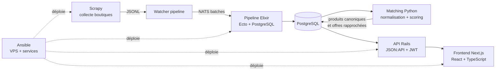
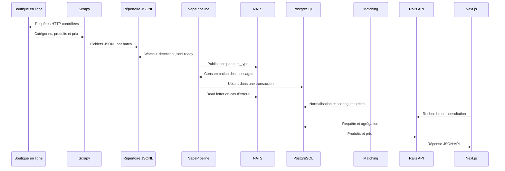

# Vapalape

Vapalape est un comparateur de prix dédié aux produits de la vape. Le système collecte les catalogues de boutiques en ligne, rapproche les offres qui désignent un même produit, historise les prix puis expose ces données au travers d'une API et d'une interface web.

Ce repository est la vitrine technique publique du projet. Le code est organisé en dépôts spécialisés, documentés depuis les dossiers [`back`](back/README.md), [`front`](front/README.md), [`infra`](infra/README.md), [`matching`](matching/README.md), [`pipeline`](pipeline/README.md) et [`scraper`](scraper/README.md).

## Architecture



Le parcours d'une donnée est le suivant :

1. Le **scraper Scrapy** visite des sites e-commerce français et exporte des items structurés en fichiers JSONL.
2. Le **pipeline Elixir** surveille un répertoire d'arrivée, publie les items sur NATS par lots et les persiste dans PostgreSQL avec Ecto.
3. Le **matching Python** normalise les noms, extrait les attributs et génère des candidats entre offres de boutiques différentes.
4. L'API Rails sert les produits canoniques, les prix, les historiques, les résultats de recherche et les fonctionnalités utilisateur.
5. Le frontend Next.js consomme l'API pour afficher recherche, fiches produits, comparaison de prix, alertes et contenus éditoriaux.
6. Ansible configure le VPS, les services, la sécurité et les processus d'exécution.

## Composants

| Dossier | Responsabilité principale | Stack |
| --- | --- | --- |
| [`scraper`](scraper/README.md) | Collecte multi-boutiques et export d'items | Python, Scrapy, PostgreSQL, proxies et middlewares anti-blocage |
| [`pipeline`](pipeline/README.md) | Ingestion fiable des JSONL et persistance événementielle | Elixir, OTP, Ecto, PostgreSQL, NATS |
| [`matching`](matching/README.md) | Résolution d'entités entre offres et produits canoniques | Python, RapidFuzz, pg_trgm, pgvector, sentence-transformers |
| [`back`](back/README.md) | API métier et services applicatifs | Ruby, Rails API-only, PostgreSQL, JWT |
| [`front`](front/README.md) | Interface de comparaison et contenus web | Next.js, React, TypeScript, Tailwind CSS |
| [`infra`](infra/README.md) | Provisionnement et exploitation du VPS | Ansible, Debian/Ubuntu, Nginx, systemd, Supervisor, PM2 |

## Flux d'ingestion



Le pipeline protège la base contre les erreurs d'ingestion : les messages sont batchés, la concurrence NATS peut être limitée par `max_messages`, les insertions sont routées par `item_type` et les erreurs sont isolées dans des dead letters. Le matching est ensuite exécuté séparément afin de pouvoir faire évoluer ses règles et ses versions de scoring sans modifier la collecte.

## Ce que le projet met en évidence

- **Résolution d'entités** : une même référence peut avoir des noms, attributs et formats différents selon les boutiques.
- **Qualité de données** : les catégories, marques, variantes, prix et historiques sont traités comme des données métier, pas comme de simples pages HTML.
- **Tolérance aux pannes** : retries, backpressure NATS, reconnexion supervisée, dead letters et réconciliation des clés étrangères différées.
- **Recherche produit** : recherche textuelle, filtres, facettes et repli SQL lorsque le moteur de recherche externe n'est pas disponible.
- **Séparation des responsabilités** : acquisition, ingestion, rapprochement, exposition et présentation sont découplés.
- **Exploitation** : le déploiement cible un VPS et automatise la configuration système, la sécurité réseau, les services web et les workers.
- **Évolutivité fonctionnelle** : prix historiques, alertes, favoris, affiliation, contenu éditorial, assistant IA et indicateurs de marché sont exposés comme des fonctionnalités distinctes.

## Organisation

```text
.
├── README.md
├── scraper/    # documentation du projet Scrapy
├── pipeline/   # documentation du pipeline Elixir/NATS
├── matching/   # documentation du matching Python
├── back/       # documentation de l'API Rails
├── front/      # documentation du frontend Next.js
└── infra/      # documentation Ansible du VPS
```

## Parcours de lecture

Pour suivre le chemin d'une donnée, commencer par [`scraper/README.md`](scraper/README.md), continuer avec [`pipeline/README.md`](pipeline/README.md), puis [`matching/README.md`](matching/README.md). Pour la consommation de ces données, lire [`back/README.md`](back/README.md) puis [`front/README.md`](front/README.md). La dimension exploitation et déploiement est détaillée dans [`infra/README.md`](infra/README.md).

Chaque README local indique également les chemins du dépôt de code correspondant, les commandes principales et les documents de référence disponibles dans ce dépôt.
