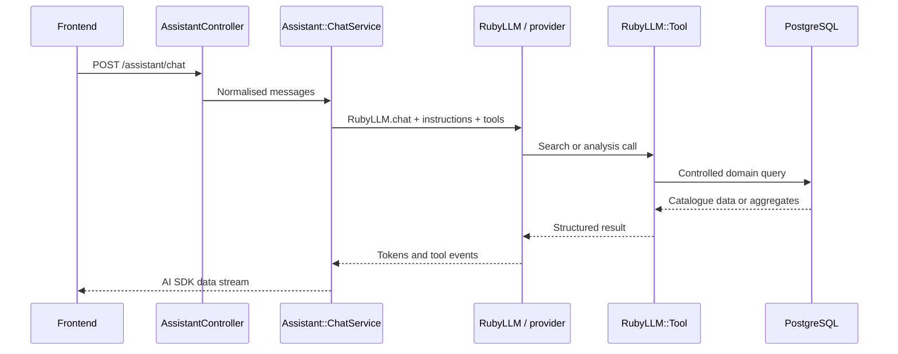

# Backend API

[Version française](README.md) | **English version**: [README.en.md](README.en.md)

The Vapalape API is the business backend for the price comparison platform. It exposes canonical products, retailer offers, prices and price histories, categories, brands, and account features.

**Local source repository:** `../api-vapalape`

## Technical stack

| Layer | Technology |
| --- | --- |
| Language | Ruby |
| Framework | Ruby on Rails 8.1.3, API-only mode |
| Server | Puma |
| Database | PostgreSQL |
| Search | Manticore Search with PostgreSQL full-text fallback |
| Vector similarity | pgvector through `neighbor` |
| Authentication | JWT and `bcrypt` |
| Authorisation | Pundit |
| Response format | JSON:API through `jsonapi-serializer` |
| Pagination | Pagy |
| Background processing | Active Job, Solid Queue |
| Tests | Minitest, FactoryBot, Faker, WebMock |
| Quality and security | RuboCop, Brakeman, Bundler Audit, SimpleCov |
| Deployment | Capistrano, Puma, GitHub Actions |

## Functional responsibilities

The API provides:

- product search and filtering by text, brand, category, price, stock, and promotion;
- price comparison for a product across multiple retailers;
- price statistics and historical price changes;
- product variants, images, categories, attributes, and reviews;
- retailer and brand pages;
- favourites and price alerts for authenticated users;
- JWT authentication with access and refresh tokens;
- affiliate click tracking;
- administration endpoints for the catalogue, prices, retailers, and scraping logs;
- a B2C AI assistant and a B2B professional assistant with streaming and business tools;
- market intelligence reports and indicators.

## LLM assistant with RubyLLM

The API includes a conversational assistant built with the [`ruby_llm`](https://github.com/crmne/ruby_llm) gem. The model never accesses the database directly: it calls Ruby tools that encapsulate domain queries and control the data exposed to the model.



### Providers and configuration

`config/initializers/ruby_llm.rb` configures several providers, enabled when their credentials are available:

- Gemini;
- OpenRouter;
- Anthropic;
- OpenAI;
- a custom OpenAI-compatible endpoint through `OPENAI_URL` or `OPENAI_API_BASE`.

The default model is `gemini-2.5-flash`, and can be overridden with `VAPALAPE_ASSISTANT_MODEL`. Provider selection, timeouts, and credentials remain server-side configuration:

```text
GEMINI_API_KEY
OPENROUTER_API_KEY
ANTHROPIC_API_KEY
OPENAI_API_KEY
OPENAI_URL
VAPALAPE_ASSISTANT_MODEL
VAPALAPE_ASSISTANT_PROVIDER
VAPALAPE_ASSISTANT_TIMEOUT
```

### Orchestration and tools

`Assistant::ChatService` builds the conversation with `RubyLLM.chat`, injects the system prompt, replays history, and attaches the available tools. For the public assistant, tools cover:

- product and category search;
- offers and prices by retailer;
- price history;
- product attributes.

For the professional assistant, tools are selected from the authenticated role:

- **retailer**: competitive position, repricing suggestions, stockout opportunities, assortment gaps, and category benchmarks;
- **brand**: price monitoring, distribution coverage, price trends, and share of shelf;
- **shared**: market trends, data quality, and report generation.

B2B tools receive a `ToolContext` built server-side from `current_user`. A retailer or brand scope therefore cannot be selected by the prompt, the HTTP client, or the model.

### Streaming and frontend integration

`AssistantController` exposes:

```text
POST /api/v1/assistant/chat
POST /api/v1/assistant/pro/chat
```

The controller normalises messages, limits them to 20, verifies that the last message comes from the user, and returns a `text/event-stream`. `ChatService` encodes events using the data stream protocol consumed by the frontend:

- progressively generated text;
- tool-call start;
- tool-call arguments;
- tool result;
- message completion;
- controlled errors.

The frontend can therefore render the answer progressively and indicate when a search or analysis is running.

### Security and observability

- The B2C chat is public but rate-limited by IP.
- The B2B chat requires a JWT and a `retailer` or `brand` role.
- System prompts prohibit inventing products, prices, stock levels, or indicators.
- Scraped descriptions are treated as untrusted data, not as instructions.
- B2B tools only return the authorised scope and aggregated indicators, preventing exposure of named competitor data.
- `Assistant::UsageTracker` records messages, LLM calls, tool calls, latency, and business events for observability and admin statistics.

The entry points are protected by `rack-attack` and an assistant-specific quota. Generation failures are converted into an error event in the stream without exposing internal details to the client.

For further details: [`app/services/assistant/chat_service.rb`](../api-vapalape/app/services/assistant/chat_service.rb), [`app/controllers/api/v1/assistant_controller.rb`](../api-vapalape/app/controllers/api/v1/assistant_controller.rb), [`app/tools/assistant`](../api-vapalape/app/tools/assistant), and [`docs/assistant_b2b_tools_analysis.md`](../api-vapalape/docs/assistant_b2b_tools_analysis.md).

## HTTP contract

The main routes are grouped under `/api/v1/`:

```text
GET  /api/v1/products
GET  /api/v1/products/:id
GET  /api/v1/products/:id/prices
GET  /api/v1/products/:id/price_histories
GET  /api/v1/products/:id/market_intelligence
GET  /api/v1/categories/tree
GET  /api/v1/brands
GET  /api/v1/stores
POST /api/v1/auth/login
POST /api/v1/auth/refresh
GET  /api/v1/favorites
POST /api/v1/price_alerts
POST /api/v1/assistant/chat
```

List responses are paginated and use JSON:API. Examples:

```text
GET /api/v1/products?q=menthol&brand_id=2&category_id=5
GET /api/v1/products?in_stock=true&on_sale=true&sort=price_asc
GET /api/v1/products?min_price=5&max_price=20
GET /api/v1/products?attributes[nicotine_level]=3mg
```

OpenAPI documentation is exposed by the application:

```text
GET /api/docs
GET /api/docs/openapi.yaml
GET /api/docs/openapi.json
```

## Product search

`ProductQuery` centralises search and filter construction. The main path can use Manticore for full-text search, resolved filters, and facets; when the service is unavailable, the query falls back to PostgreSQL.

The project also retains PostgreSQL search using `tsvector`, `unaccent`, the French dictionary, and a GIN index. This decision is documented in [`docs/adr/2026-06-29-manticore-search-decision.md`](../api-vapalape/docs/adr/2026-06-29-manticore-search-decision.md).

The search layer is used to:

- search product names;
- filter normalised attributes;
- preserve the relevance order returned by the search engine;
- provide paginated results and facets to the frontend.

## Security and resilience

- Authenticated endpoints use `Authorization: Bearer <token>`.
- Administration endpoints live under `/api/v1/admin/` and require the administrator role.
- `rack-attack` limits sensitive routes, including authentication, contact, writes, and the AI assistant.
- CORS is configured per environment.
- Brakeman and Bundler Audit run in CI.
- API errors follow a JSON structure containing `status`, `code`, and `detail`.

## Code organisation

```text
app/
├── controllers/api/v1/  # public, authenticated, and admin endpoints
├── models/              # catalogue, users, prices, alerts, assistant
├── queries/             # search and market intelligence queries
├── serializers/         # JSON:API representations
├── services/            # AI assistant, email, and domain services
├── jobs/                # view refresh and reindexing
└── tools/assistant/      # tools callable by the assistant

config/
├── routes.rb
├── recurring.yml        # recurring jobs
└── initializers/        # JWT, CORS, rate limiting, search

test/
├── models/
├── controllers/api/v1/
└── services/
```

## Development and CI

```bash
bundle install
rails db:create db:migrate
rails server

rails test
bin/rubocop
bin/brakeman
bin/bundler-audit
bin/docs:lint
rails openapi:check_coverage
```

CI runs security checks, Ruby linting, the Minitest suite with PostgreSQL, and coverage checks. Deployment is triggered by version tags and handled by Capistrano.

For further details: [`README.md`](../api-vapalape/README.md), [`docs/api/v1.md`](../api-vapalape/docs/api/v1.md), and [`swagger/v1/openapi.yaml`](../api-vapalape/swagger/v1/openapi.yaml).
