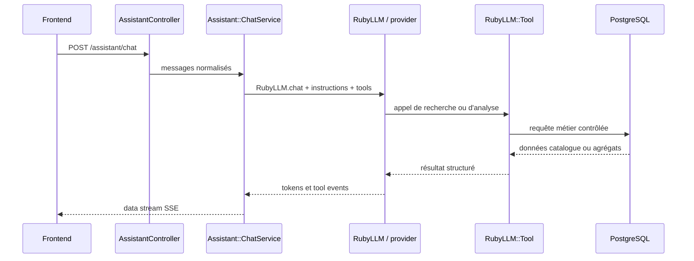

# Backend API

[Version française](README.md) | **English version**: [README.en.md](README.en.md)

L'API Vapalape est le backend métier du comparateur de prix. Elle expose les produits canoniques, les offres des boutiques, les prix et leurs historiques, les catégories, les marques et les fonctionnalités de compte.

**Code source local :** `../api-vapalape`

## Stack technique

| Couche | Technologie |
| --- | --- |
| Langage | Ruby |
| Framework | Ruby on Rails 8.1.3, mode API-only |
| Serveur | Puma |
| Base de données | PostgreSQL |
| Recherche | Manticore Search avec repli PostgreSQL full-text |
| Similarité vectorielle | pgvector via `neighbor` |
| Authentification | JWT et `bcrypt` |
| Autorisation | Pundit |
| Format des réponses | JSON:API via `jsonapi-serializer` |
| Pagination | Pagy |
| Jobs et traitements différés | Active Job, Solid Queue |
| Tests | Minitest, FactoryBot, Faker, WebMock |
| Qualité et sécurité | RuboCop, Brakeman, Bundler Audit, SimpleCov |
| Déploiement | Capistrano, Puma, GitHub Actions |

## Responsabilités fonctionnelles

L'API fournit notamment :

- recherche et filtrage des produits par texte, marque, catégorie, prix, stock et promotion ;
- comparaison des prix d'un produit entre plusieurs boutiques ;
- prix statistiques et historique des évolutions ;
- variantes, images, catégories, attributs et avis produits ;
- pages de boutiques et de marques ;
- favoris et alertes de prix pour les utilisateurs authentifiés ;
- authentification JWT avec access token et refresh token ;
- tracking des clics d'affiliation ;
- endpoints administrateur pour gérer le catalogue, les prix, les boutiques et les logs de scraping ;
- assistant IA B2C et assistant professionnel B2B, avec streaming et outils métier ;
- rapports et indicateurs de market intelligence.

## Assistant LLM avec RubyLLM

L'API intègre un assistant conversationnel basé sur le gem [`ruby_llm`](https://github.com/crmne/ruby_llm). Le modèle n'accède jamais directement à la base : il appelle des tools Ruby qui encapsulent les requêtes métier et contrôlent les données exposées.



### Providers et configuration

`config/initializers/ruby_llm.rb` configure plusieurs providers activables selon les clés présentes dans l'environnement :

- Gemini ;
- OpenRouter ;
- Anthropic ;
- OpenAI ;
- endpoint OpenAI-compatible personnalisé via `OPENAI_URL` ou `OPENAI_API_BASE`.

Le modèle par défaut est `gemini-2.5-flash`, surchargeable avec `VAPALAPE_ASSISTANT_MODEL`. Le provider, le timeout et les credentials restent en configuration serveur :

```text
GEMINI_API_KEY
OPENROUTER_API_KEY
ANTHROPIC_API_KEY
OPENAI_API_KEY
OPENAI_URL
VAPALAPE_ASSISTANT_MODEL
VAPALAPE_ASSISTANT_PROVIDER
VAPALAPE_ASSISTANT_TIMEOUT
```

### Orchestration et tools

`Assistant::ChatService` construit la conversation avec `RubyLLM.chat`, injecte le prompt système, rejoue l'historique et attache les tools disponibles. Pour le parcours grand public, les tools couvrent notamment :

- recherche de produits et de catégories ;
- offres et prix par boutique ;
- historique des prix ;
- attributs produits.

Pour le parcours professionnel, les tools sont sélectionnés selon le rôle authentifié :

- **retailer** : position concurrentielle, suggestions de repricing, ruptures potentielles, trous d'assortiment et benchmarks de catégories ;
- **brand** : suivi des prix, couverture de distribution, tendances de prix et part de rayon ;
- **partagés** : tendances marché, qualité des données et génération de rapports.

Les tools B2B reçoivent un `ToolContext` construit côté serveur à partir de `current_user`. Le périmètre d'une boutique ou d'une marque ne peut donc pas être choisi par le prompt, le client HTTP ou le modèle.

### Streaming et intégration frontend

`AssistantController` expose :

```text
POST /api/v1/assistant/chat
POST /api/v1/assistant/pro/chat
```

Le contrôleur normalise les messages, limite leur nombre à 20, vérifie que le dernier message vient de l'utilisateur et renvoie un flux `text/event-stream`. `ChatService` encode les événements dans le protocole data stream consommé par le frontend :

- texte généré progressivement ;
- début d'appel d'outil ;
- arguments de l'appel ;
- résultat de l'outil ;
- fin de message ;
- erreur contrôlée.

Le frontend peut ainsi afficher la réponse au fil de sa génération et signaler qu'une recherche ou une analyse est en cours.

### Sécurité et observabilité

- Le chat B2C est public mais soumis à un rate limit par IP.
- Le chat B2B exige un JWT et un rôle `retailer` ou `brand`.
- Les prompts système interdisent l'invention de produits, prix, stocks ou indicateurs.
- Les descriptions scrapées sont traitées comme des données non fiables et non comme des instructions.
- Les tools B2B ne renvoient que le périmètre autorisé et des indicateurs agrégés pour éviter l'exposition de données concurrentielles nominatives.
- `Assistant::UsageTracker` journalise les messages, appels LLM, appels de tools, latences et événements métier pour l'observabilité et les statistiques administrateur.

Les points d'entrée sont protégés par `rack-attack` et par un quota spécifique à l'assistant. Les erreurs de génération sont converties en événement d'erreur dans le stream sans exposer les détails internes au client.

Pour approfondir : [`app/services/assistant/chat_service.rb`](../api-vapalape/app/services/assistant/chat_service.rb), [`app/controllers/api/v1/assistant_controller.rb`](../api-vapalape/app/controllers/api/v1/assistant_controller.rb), [`app/tools/assistant`](../api-vapalape/app/tools/assistant) et [`docs/assistant_b2b_tools_analysis.md`](../api-vapalape/docs/assistant_b2b_tools_analysis.md).

## Contrat HTTP

Les routes principales sont regroupées sous `/api/v1/` :

```text
GET  /api/v1/products
GET  /api/v1/products/:id
GET  /api/v1/products/:id/prices
GET  /api/v1/products/:id/price_histories
GET  /api/v1/products/:id/market_intelligence
GET  /api/v1/categories/tree
GET  /api/v1/brands
GET  /api/v1/stores
POST /api/v1/auth/login
POST /api/v1/auth/refresh
GET  /api/v1/favorites
POST /api/v1/price_alerts
POST /api/v1/assistant/chat
```

Les réponses de listes sont paginées et utilisent JSON:API. Exemple de recherche :

```text
GET /api/v1/products?q=menthol&brand_id=2&category_id=5
GET /api/v1/products?in_stock=true&on_sale=true&sort=price_asc
GET /api/v1/products?min_price=5&max_price=20
GET /api/v1/products?attributes[nicotine_level]=3mg
```

La documentation OpenAPI est exposée par l'application :

```text
GET /api/docs
GET /api/docs/openapi.yaml
GET /api/docs/openapi.json
```

## Recherche produit

`ProductQuery` centralise la construction des recherches et des filtres. Le chemin nominal peut utiliser Manticore pour la recherche plein texte, les filtres résolus et les facettes ; si le service est indisponible, la requête revient vers PostgreSQL.

Le projet conserve également une recherche PostgreSQL avec `tsvector`, `unaccent`, dictionnaire français et index GIN. Ce choix est documenté dans [`docs/adr/2026-06-29-manticore-search-decision.md`](../api-vapalape/docs/adr/2026-06-29-manticore-search-decision.md).

Le moteur est utilisé pour :

- rechercher dans les noms de produits ;
- filtrer des attributs normalisés ;
- préserver l'ordre de pertinence des identifiants retournés ;
- fournir des résultats paginés et des facettes au frontend.

## Sécurité et résilience

- Les endpoints authentifiés utilisent `Authorization: Bearer <token>`.
- Les accès d'administration sont séparés sous `/api/v1/admin/` et soumis au rôle administrateur.
- `rack-attack` limite les routes sensibles, notamment l'authentification, le contact, les écritures et l'assistant IA.
- CORS est configuré par environnement.
- Brakeman et Bundler Audit sont exécutés en CI.
- Les erreurs API suivent une structure JSON avec `status`, `code` et `detail`.

## Organisation du code

```text
app/
├── controllers/api/v1/  # endpoints publics, authentifiés et admin
├── models/              # catalogue, utilisateurs, prix, alertes, assistant
├── queries/             # recherches et indicateurs de marché
├── serializers/         # représentations JSON:API
├── services/            # assistant IA, email et traitements métier
├── jobs/                # refresh des vues et réindexation
└── tools/assistant/      # outils appelables par l'assistant

config/
├── routes.rb
├── recurring.yml        # tâches récurrentes
└── initializers/        # JWT, CORS, rate limit, recherche

test/
├── models/
├── controllers/api/v1/
└── services/
```

## Développement et CI

```bash
bundle install
rails db:create db:migrate
rails server

rails test
bin/rubocop
bin/brakeman
bin/bundler-audit
bin/docs:lint
rails openapi:check_coverage
```

La CI exécute les contrôles de sécurité, le lint Ruby, la suite Minitest avec PostgreSQL et le contrôle de couverture. Le déploiement est déclenché par les tags de version et passe par Capistrano.

Pour approfondir : [`README.md`](../api-vapalape/README.md), [`docs/api/v1.md`](../api-vapalape/docs/api/v1.md) et [`swagger/v1/openapi.yaml`](../api-vapalape/swagger/v1/openapi.yaml).
