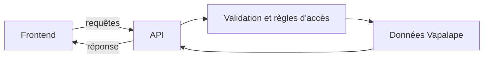

# Backend API

- Dépôt associé : `../api-vapalape`
- Rôle : exposer les données et les fonctionnalités de Vapalape aux clients applicatifs.

## Responsabilités

Le backend constitue la frontière entre le domaine Vapalape et ses consommateurs, notamment le frontend. Il a vocation à :

- recevoir les requêtes des clients ;
- exposer les ressources du produit via une API ;
- appliquer les règles d'accès et de validation adaptées aux requêtes ;
- agréger les données préparées par les traitements en amont ;
- fournir un contrat stable au frontend.

## Intérêt dans l'architecture

L'API découple l'interface utilisateur de la collecte et du traitement des données. Le frontend ne dépend donc pas directement des sources externes ni des traitements internes : il consomme un contrat applicatif centré sur les besoins du produit.

Les données sont produites en amont par le [`pipeline`](../pipeline/README.md) et le [`matching`](../matching/README.md), puis rendues accessibles au frontend via ce composant.

## Lire le code

Pour les détails d'implémentation, les routes, les modèles, les contrats de réponse et les commandes de développement, consulter le dépôt [`api-vapalape`](../api-vapalape) lorsqu'il est disponible dans l'organisation locale.
