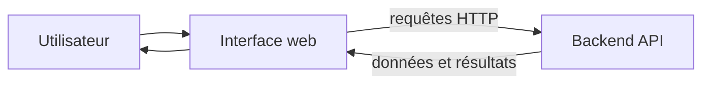

# Frontend

- Dépôt associé : `../front-vapalape`
- Rôle : présenter Vapalape aux utilisateurs et consommer les fonctionnalités exposées par l'API.

## Responsabilités

Le frontend porte la couche de présentation et l'expérience utilisateur. Il a vocation à :

- afficher les lieux, activités ou résultats pertinents ;
- recueillir les préférences et actions de l'utilisateur ;
- appeler le backend via son API ;
- gérer les états d'interface liés au chargement, aux erreurs et aux résultats vides ;
- rendre les informations produites par le matching compréhensibles et actionnables.

## Intérêt dans l'architecture

Le frontend reste centré sur la présentation et les interactions. La logique de collecte, de préparation et de matching est exécutée par les composants spécialisés en amont et exposée au travers du backend.

Cette séparation facilite l'évolution de l'interface sans dupliquer les règles métier dans le navigateur.

## Lire le code

Pour les détails d'implémentation, les écrans, les composants, le contrat API consommé et les commandes de développement, consulter le dépôt [`front-vapalape`](../front-vapalape) lorsqu'il est disponible dans l'organisation locale.
