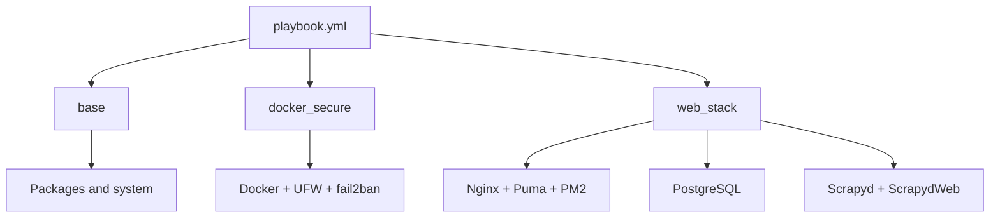

# VPS Infrastructure

[Version française](README.md) | **English version**: [README.en.md](README.en.md)

The infrastructure automates the installation and operation of Vapalape on a VPS. The playbook configures the system base, Docker, PostgreSQL, application runtimes, reverse proxy, and scraping processes.

**Local source repository:** `../ansible-vapalape`

## Technical stack

| Area | Technology |
| --- | --- |
| Automation | Ansible |
| Target system | Debian or Ubuntu, OVH VPS |
| Reverse proxy | Nginx |
| Backend | Ruby through rbenv, Puma, and systemd |
| Frontend | Node.js through NVM, Next.js, and PM2 |
| Scraping | Scrapy, Scrapyd, and ScrapydWeb under Supervisor |
| Database | PostgreSQL |
| Containers | Docker |
| Security | UFW, fail2ban, SSH keys, Docker hardening |
| TLS | Certbot task available in the web role |
| Collections | `community.general`, `ansible.posix` |

## Main playbook

`playbook.yml` targets the `vps` group and applies three roles:

```yaml
roles:
  - base
  - docker_secure
  - web_stack
```

The `base` role prepares the operating system. `docker_secure` installs and hardens Docker, configures the firewall, and applies system protections. `web_stack` installs and configures PostgreSQL, rbenv, NVM, PM2, Nginx, Supervisor, Scrapyd, ScrapydWeb, systemd, sysctl, and swap.



## Applied security

The configuration includes:

- target distribution validation before execution;
- SSH key authentication and root access disabled by the system tasks;
- UFW firewall with limited SSH exposure;
- Docker configured with `userns-remap`, container isolation (`docker_icc: false`), and log rotation;
- fail2ban for SSH and additional abuse protection;
- Nginx security headers and rules;
- separate deployment users and service boundaries;
- persistent services supervised by systemd, Supervisor, or PM2 depending on the component.

Operational values are grouped in `group_vars/vps.yml`, and generated configurations are versioned Jinja2 templates.

## Deployment

Prepare the `.env` file used by the script, then install the Ansible collections and apply the playbook:

```bash
cp .env.example .env
./setup.sh
```

The script installs the Ansible collections and currently runs the `nvm` tag. Other tasks can be targeted with tags such as `nginx`, `rbenv`, `postgresql`, or `fail2ban_crypto`.

To inspect the remote machine:

```bash
ansible vps -m ansible.builtin.setup
ansible vps -m ansible.builtin.setup \
  -a "filter=ansible_facts['distribution*']"
```

## Service integration

Nginx is the public entry point and routes traffic to the applications. Dedicated templates cover:

- general Nginx configuration and Brotli/Gzip compression;
- Vapalape production rules;
- Puma for Rails;
- PM2 for Next.js;
- Scrapyd and ScrapydWeb under Supervisor;
- PostgreSQL and its network rules;
- the maintenance page.

This repository does not contain business logic. It provides the reproducible environment required to run the application repositories.

For further details: [`README.md`](../ansible-vapalape/README.md), [`playbook.yml`](../ansible-vapalape/playbook.yml), and [`roles/web_stack`](../ansible-vapalape/roles/web_stack).
