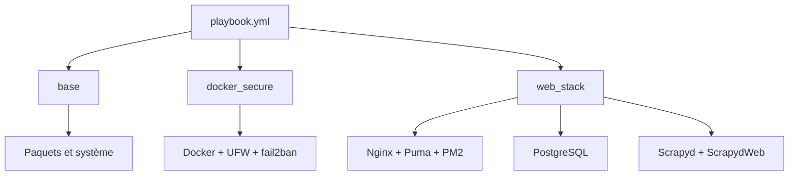

# Infrastructure VPS

[Version française](README.md) | **English version**: [README.en.md](README.en.md)

L'infrastructure automatise l'installation et l'exploitation de Vapalape sur un VPS. Le playbook configure le socle système, Docker, PostgreSQL, les runtimes applicatifs, le reverse proxy et les processus de scraping.

**Code source local :** `../ansible-vapalape`

## Stack technique

| Domaine | Technologie |
| --- | --- |
| Automatisation | Ansible |
| Système cible | Debian ou Ubuntu, VPS OVH |
| Reverse proxy | Nginx |
| Backend | Ruby via rbenv, Puma et systemd |
| Frontend | Node.js via NVM, Next.js et PM2 |
| Scraping | Scrapy, Scrapyd et ScrapydWeb sous Supervisor |
| Base de données | PostgreSQL |
| Conteneurs | Docker |
| Sécurité | UFW, fail2ban, SSH par clé, durcissement Docker |
| TLS | Certbot prévu dans le rôle web |
| Collections | `community.general`, `ansible.posix` |

## Playbook principal

`playbook.yml` cible le groupe `vps` et applique trois rôles :

```yaml
roles:
  - base
  - docker_secure
  - web_stack
```

Le rôle `base` prépare le système. `docker_secure` installe et durcit Docker, configure le firewall et les protections système. `web_stack` installe et configure PostgreSQL, rbenv, NVM, PM2, Nginx, Supervisor, Scrapyd, ScrapydWeb, systemd, sysctl et le swap.



## Sécurité appliquée

La configuration prévoit notamment :

- vérification de la distribution cible avant exécution ;
- authentification SSH par clé et désactivation de root selon les tâches système ;
- firewall UFW avec exposition limitée du port SSH ;
- configuration Docker avec `userns-remap`, isolation inter-conteneurs (`docker_icc: false`) et rotation des logs ;
- fail2ban pour SSH et protection complémentaire contre certains abus ;
- en-têtes et règles de sécurité Nginx ;
- séparation des services et utilisateurs de déploiement ;
- services persistants supervisés par systemd, Supervisor ou PM2 selon le composant.

Les valeurs opérationnelles sont regroupées dans `group_vars/vps.yml`, et les configurations générées sont des templates Jinja2 versionnés.

## Déploiement

Préparer un fichier `.env` utilisé par le script, puis installer les collections et appliquer le playbook :

```bash
cp .env.example .env
./setup.sh
```

Le script installe les collections Ansible et lance actuellement le tag `nvm`. Les autres sous-tâches peuvent être ciblées avec des tags comme `nginx`, `rbenv`, `postgresql` ou `fail2ban_crypto`.

Pour inspecter la machine distante :

```bash
ansible vps -m ansible.builtin.setup
ansible vps -m ansible.builtin.setup \
  -a "filter=ansible_facts['distribution*']"
```

## Intégration des services

Nginx sert de point d'entrée public et route vers les applications. Les templates dédiés couvrent notamment :

- la configuration générale Nginx et la compression Brotli/Gzip ;
- les règles de production Vapalape ;
- Puma pour Rails ;
- PM2 pour Next.js ;
- Scrapyd et ScrapydWeb sous Supervisor ;
- PostgreSQL et ses règles réseau ;
- la page de maintenance.

Le dépôt ne porte pas la logique métier : il fournit l'environnement reproductible nécessaire à l'exécution des dépôts applicatifs.

Pour approfondir : [`README.md`](../ansible-vapalape/README.md), [`playbook.yml`](../ansible-vapalape/playbook.yml) et [`roles/web_stack`](../ansible-vapalape/roles/web_stack).
