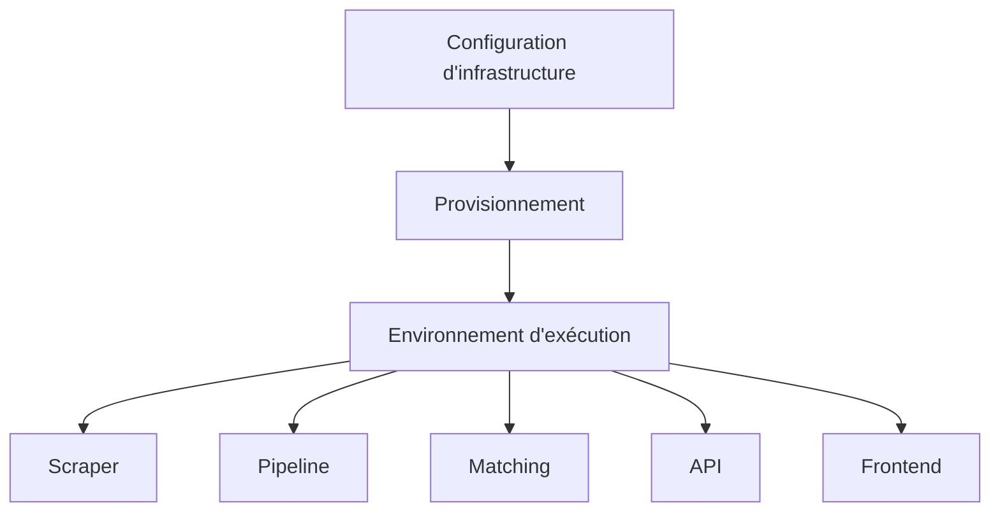

# Infrastructure

- Dépôt associé : `../ansible-vapalape`
- Rôle : automatiser le provisionnement, la configuration et le déploiement des composants Vapalape.

## Responsabilités

L'infrastructure fournit le cadre reproductible nécessaire pour exécuter le système. Elle a vocation à :

- décrire les machines et services nécessaires ;
- installer les dépendances des composants ;
- configurer les environnements ;
- déployer les versions applicatives ;
- limiter les opérations manuelles et documenter les prérequis d'exploitation.

## Intérêt dans l'architecture

L'automatisation permet de traiter l'infrastructure comme du code : un environnement peut être reconstruit de manière cohérente, les écarts de configuration sont réduits et les déploiements deviennent auditable.

Ce composant est transversal aux autres briques. Il ne porte pas la logique produit ; il rend son exécution fiable et reproductible.

## Lire le code

Pour les rôles, variables, inventaires, prérequis et procédures de déploiement, consulter le dépôt [`ansible-vapalape`](../ansible-vapalape) lorsqu'il est disponible dans l'organisation locale.
