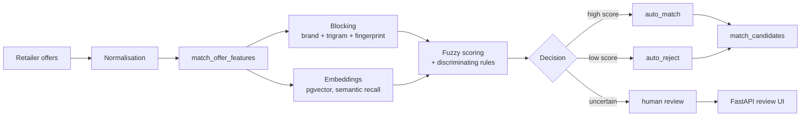

# Product Matching

[Version française](README.md) | **English version**: [README.en.md](README.en.md)

The matching component links offers collected from retailers (`product_stores`) to the correct canonical product (`products`). This makes it possible to compare the price of the same product across multiple sellers despite differences in names, attributes, and formats.

**Local source repository:** `../matching-vapalape`

The goal is twofold: maintain **high precision** so different products are never merged, while achieving **good recall** when retailers describe the same product differently.

## Technical stack

| Layer | Technology |
| --- | --- |
| Language | Python 3.11+ |
| Environment management | uv |
| Database access | PostgreSQL through `psycopg2` |
| Blocking | `pg_trgm` and computed fingerprints |
| Lexical scoring | RapidFuzz, token set ratio, and Jaro-Winkler |
| Embeddings | sentence-transformers, multilingual MiniLM model |
| Vector search | pgvector |
| Review UI | FastAPI, Uvicorn, Jinja2, HTMX |
| Optional ML | Splink, DuckDB, and pandas |
| Tests | pytest |
| Packaging | setuptools and `pyproject.toml` |
| Execution | Docker, docker-compose, just |

## Matching pipeline



The processing stages are:

1. **Normalisation**: text cleaning, transliteration, tokens, brand, EAN, model, volume, nicotine, and other attributes.
2. **Blocking**: reduce candidate pairs using brand, trigram similarity, compatible categories, and fingerprints.
3. **Scoring**: combine RapidFuzz, trigrams, and discriminating attributes.
4. **Optional embeddings**: semantic recall for synonyms such as “battery” and “accu”; an embedding alone never triggers an `auto_match`.
5. **Decision**: separate `auto_match`, `review`, and `auto_reject`.
6. **Application**: write accepted decisions to the canonical model and track processing versions.

A mismatch in volume, nicotine, power, model, brand, or fingerprint can strongly cap the score even when names are similar. This protects against incorrect merges and transitive bridges between distinct products.

## Main commands

```bash
uv sync
uv run --extra dev python -m pytest

uv run --extra db python -m vapalape_matching.pipeline.normalize_offers --all
uv run --extra db python -m vapalape_matching.pipeline.match_candidates --cross-store
uv run --extra db --extra embeddings \
  python -m vapalape_matching.pipeline.embed_offers --all
```

Runners accept `--limit`, `--dry-run`, and `--help`. Extras are separated so heavy dependencies are not installed when a process does not require the database or embeddings.

## Human review and rules

The `vapalape_matching.ui` package provides a FastAPI interface to:

- browse candidates sorted by score with cursor pagination;
- label a pair as a match or non-match;
- undo the last decision;
- inspect review queue statistics;
- create and apply targeted review rules.

Human decisions are stored in the database and reused by incremental processing. The code also handles reconciliation of brands, attributes, EANs, categories, and duplicate products.

## Schema and integration

The `match_*` tables live in the Rails backend database and use PostgreSQL, `pg_trgm`, and pgvector. Migrations and the reference schema must be applied before running the pipeline.

The matching service is decoupled from the backend at code level, but shares its data model so the results can be consumed directly by the API.

## Docker and operations

```bash
docker build -t matching-vapalape .
docker run --rm --env-file .env matching-vapalape

docker compose run --rm matching
```

The production image bundles the database and embedding extras as well as the pre-downloaded embedding model. The runtime therefore does not need access to Hugging Face to start.

Operational procedures are documented in [`docs/deployment.md`](../matching-vapalape/docs/deployment.md), [`docs/production-readiness.md`](../matching-vapalape/docs/production-readiness.md), and [`docs/runbook.md`](../matching-vapalape/docs/runbook.md).
