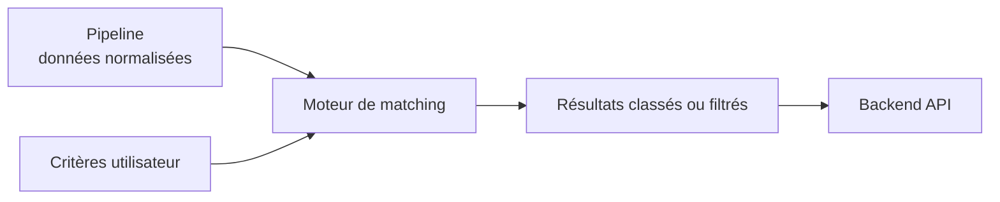

# Matching

- Dépôt associé : `../matching-vapalape`
- Rôle : calculer les correspondances entre les données disponibles et les critères du produit.

## Responsabilités

Le composant de matching isole la logique métier qui permet de classer, rapprocher ou sélectionner les résultats pertinents. Il a vocation à :

- recevoir des données normalisées ;
- interpréter les critères utiles au rapprochement ;
- calculer les correspondances ;
- produire des résultats exploitables par le backend ;
- faire évoluer les règles de sélection sans coupler cette logique à l'interface.

## Intérêt dans l'architecture

Le matching est un module métier indépendant des détails de collecte et de présentation. Le pipeline se concentre sur la qualité et la forme des données, tandis que le frontend reçoit des résultats déjà interprétés par le backend.

Cette frontière rend les règles de matching testables et permet d'envisager plusieurs modes d'exécution sans modifier l'interface utilisateur.

## Lire le code

Pour les règles de calcul, les modèles d'entrée et de sortie et les tests associés, consulter le dépôt [`matching-vapalape`](../matching-vapalape) lorsqu'il est disponible dans l'organisation locale.
