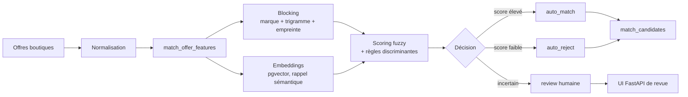

# Product Matching

Le composant de matching rattache les offres collectées dans les boutiques (`product_stores`) au bon produit canonique (`products`). Il rend possible la comparaison du prix d'un même produit entre plusieurs vendeurs, malgré les différences de libellés, d'attributs et de formats.

**Code source local :** `../matching-vapalape`

L'objectif est double : conserver une **haute précision** pour ne pas fusionner deux produits différents, tout en obtenant un **bon rappel** lorsque deux boutiques décrivent le même produit de manière différente.

## Stack technique

| Couche | Technologie |
| --- | --- |
| Langage | Python 3.11+ |
| Gestion d'environnement | uv |
| Accès base | PostgreSQL via `psycopg2` |
| Blocking | `pg_trgm` et empreintes calculées |
| Scoring lexical | RapidFuzz, token set ratio et Jaro-Winkler |
| Embeddings | sentence-transformers, modèle multilingue MiniLM |
| Recherche vectorielle | pgvector |
| UI de revue | FastAPI, Uvicorn, Jinja2, HTMX |
| Option ML | Splink, DuckDB et pandas |
| Tests | pytest |
| Packaging | setuptools et `pyproject.toml` |
| Exécution | Docker, docker-compose, just |

## Pipeline de rapprochement



Le traitement est structuré en étapes :

1. **Normalisation** : nettoyage du texte, translittération, tokens, marque, EAN, modèle, volume, nicotine et autres attributs.
2. **Blocking** : réduction du nombre de paires candidates par marque, similarité trigramme, catégories compatibles et empreinte.
3. **Scoring** : combinaison de RapidFuzz, trigrammes et attributs discriminants.
4. **Embeddings optionnels** : rappel sémantique pour des synonymes comme « batterie » et « accu » ; un embedding seul ne déclenche pas un `auto_match`.
5. **Décision** : séparation entre `auto_match`, `review` et `auto_reject`.
6. **Application** : écriture des décisions validées dans le modèle canonique et suivi des versions de traitement.

Une divergence de volume, nicotine, puissance, modèle, marque ou fingerprint peut plafonner fortement le score même si les noms sont proches. Cette règle protège contre les fusions abusives et les ponts transitifs entre produits différents.

## Commandes principales

```bash
uv sync
uv run --extra dev python -m pytest

uv run --extra db python -m vapalape_matching.pipeline.normalize_offers --all
uv run --extra db python -m vapalape_matching.pipeline.match_candidates --cross-store
uv run --extra db --extra embeddings \
  python -m vapalape_matching.pipeline.embed_offers --all
```

Les runners acceptent `--limit`, `--dry-run` et `--help`. Les extras sont séparés pour éviter d'installer les dépendances lourdes lorsqu'un traitement ne nécessite pas la base ou les embeddings.

## Revue humaine et règles

Le package `vapalape_matching.ui` fournit une interface FastAPI pour :

- parcourir les candidats triés par score avec pagination par curseur ;
- marquer une paire comme match ou non-match ;
- annuler la dernière décision ;
- consulter les statistiques de la file de revue ;
- créer et appliquer des règles de revue ciblées.

Les décisions humaines sont conservées dans la base et réutilisables lors des traitements incrémentaux. Le code gère également la réconciliation des marques, attributs, EAN, catégories et produits dupliqués.

## Schéma et intégration

Les tables `match_*` sont hébergées dans la base du backend Rails et utilisent PostgreSQL, `pg_trgm` et pgvector. Les migrations et le schéma de référence doivent être appliqués avant l'exécution du pipeline.

Le matching est donc découplé du backend au niveau du code, mais partage son modèle de données afin que les résultats deviennent directement consultables par l'API.

## Docker et exploitation

```bash
docker build -t matching-vapalape .
docker run --rm --env-file .env matching-vapalape

docker compose run --rm matching
```

L'image de production embarque les extras base et embeddings ainsi que le modèle d'embeddings pré-téléchargé. Le runtime n'a donc pas besoin d'accéder à Hugging Face pour démarrer.

Les procédures d'exploitation sont décrites dans [`docs/deployment.md`](../matching-vapalape/docs/deployment.md), [`docs/production-readiness.md`](../matching-vapalape/docs/production-readiness.md) et [`docs/runbook.md`](../matching-vapalape/docs/runbook.md).
