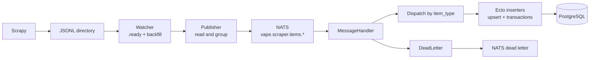

# Ingestion Pipeline

[Version française](README.md) | **English version**: [README.en.md](README.en.md)

`VapePipeline` is the Elixir service that transforms scraper JSONL exports into NATS messages and PostgreSQL writes. It provides supervised, asynchronous, replayable ingestion for retailers, brands, categories, products, variants, prices, price histories, and scraping logs.

**Local source repository:** `../pipeline-vapalape`

## Technical stack

| Layer | Technology |
| --- | --- |
| Language and runtime | Elixir 1.19.5, OTP 27 |
| Application framework | OTP supervision tree |
| Persistence | Ecto SQL and Postgrex |
| Database | PostgreSQL, shared schema with Rails |
| Messaging | NATS through Gnat |
| File watching | FileSystem |
| Configuration | Dotenvy and `config/runtime.exs` |
| Tests | ExUnit, Mox, ExMachina, ExCoveralls |
| Quality | Credo and Dialyzer |
| Release | Mix release |
| Deployment | Docker or supervised release |

## Ingestion flow



The service starts with a supervision tree containing:

- `VapePipeline.Repo` for PostgreSQL;
- `Gnat.ConnectionSupervisor` with automatic reconnection;
- `VapePipeline.ConsumerSupervisor` for NATS subscriptions;
- `VapePipeline.Watcher` for JSONL files;
- `VapePipeline.Reconciler` for deferred foreign keys.

## JSONL contract and NATS subjects

Each line exported by Scrapy contains `item_type`:

```json
{"item_type":"product","name":"E-liquid Mint","brand_name":"Pulp"}
{"item_type":"price","product_store_id":42,"price":"9.90","currency":"EUR","in_stock":true}
```

The publisher groups lines by type and publishes batches of 50 items by default:

```json
{
  "item_type": "product",
  "items": [
    {"item_type": "product", "name": "Product A"},
    {"item_type": "product", "name": "Product B"}
  ]
}
```

Main subjects include `vape.scraper.items.product`, `price`, `price_history`, `store`, `brand`, `category`, `product_store`, and `scraping_log`. Invalid lines and processing failures are sent to `vape.scraper.dead_letter` and can be replayed.

## Reliability and consistency

- Files are moved to `processed` or `failed` directories.
- The watcher can backfill files present after a restart with `WATCHER_BACKFILL_ON_START`.
- A `.jsonl.ready` sentinel can ensure a file is complete before processing.
- Messages are routed to specialised inserters by `item_type`.
- Inserts use Ecto and upsert operations aligned with the Rails data model.
- Errors are captured without crashing the consumer and persisted as dead letters.
- `max_messages` applies NATS backpressure when the PostgreSQL pool is under pressure.
- The reconciler periodically handles relationships whose foreign key was missing during the initial ingestion.

This decoupling lets the scraper produce files while the pipeline absorbs throughput variations without directly coupling both processes.

## Configuration

Important variables include:

```text
DATABASE_URL
POOL_SIZE
NATS_HOST / NATS_PORT / NATS_TLS
JSONL_WATCH_DIR
JSONL_PROCESSED_DIR
JSONL_FAILED_DIR
NATS_SUBJECT_PREFIX
NATS_DEAD_LETTER_SUBJECT
NATS_BATCH_SIZE
RECONCILER_INTERVAL
```

In production, `DATABASE_URL`, the three JSONL directories, and NATS connection settings are required. Values and validation are centralised in `config/runtime.exs` and `VapePipeline.Config`.

## Development and deployment

```bash
mix deps.get
mix ecto.setup
mix test
mix qa

MIX_ENV=prod mix release
_build/prod/rel/vape_pipeline/bin/vape_pipeline start
_build/prod/rel/vape_pipeline/bin/vape_pipeline eval \
  "VapePipeline.Release.migrate()"
```

The repository also contains a Docker NATS configuration, a deployment script, Mix reconciliation tasks, and tests covering the watcher, publisher, batches, dead letters, inserters, and foreign-key resolution.

For further details: [`README.md`](../pipeline-vapalape/README.md), [`envs/env.example`](../pipeline-vapalape/envs/env.example), and [`supervisord/README.md`](../pipeline-vapalape/supervisord/README.md).
