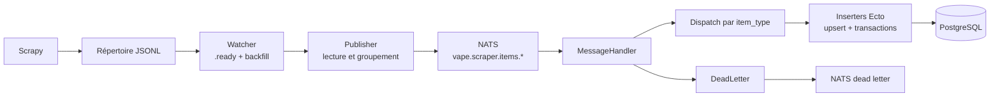

# Pipeline d'ingestion

`VapePipeline` est le service Elixir qui transforme les exports JSONL du scraper en messages NATS puis en écritures PostgreSQL. Il fournit une ingestion asynchrone, supervisée et rejouable pour les magasins, marques, catégories, produits, variantes, prix, historiques et logs de scraping.

**Code source local :** `../pipeline-vapalape`

## Stack technique

| Couche | Technologie |
| --- | --- |
| Langage et runtime | Elixir 1.19.5, OTP 27 |
| Framework applicatif | OTP supervision tree |
| Persistance | Ecto SQL et Postgrex |
| Base de données | PostgreSQL, schéma partagé avec Rails |
| Messaging | NATS via Gnat |
| Surveillance fichiers | FileSystem |
| Configuration | Dotenvy et `config/runtime.exs` |
| Tests | ExUnit, Mox, ExMachina, ExCoveralls |
| Qualité | Credo et Dialyzer |
| Release | Mix release |
| Déploiement | Docker ou release supervisée |

## Flux d'ingestion



Le service démarre avec un arbre de supervision comprenant :

- `VapePipeline.Repo` pour PostgreSQL ;
- `Gnat.ConnectionSupervisor` avec reconnexion automatique ;
- `VapePipeline.ConsumerSupervisor` pour les abonnements NATS ;
- `VapePipeline.Watcher` pour les fichiers JSONL ;
- `VapePipeline.Reconciler` pour les clés étrangères différées.

## Contrat JSONL et sujets NATS

Chaque ligne exportée par Scrapy contient `item_type` :

```json
{"item_type":"product","name":"E-liquide Menthe","brand_name":"Pulp"}
{"item_type":"price","product_store_id":42,"price":"9.90","currency":"EUR","in_stock":true}
```

Le publisher groupe les lignes par type et publie des batches, par défaut de 50 éléments :

```json
{
  "item_type": "product",
  "items": [
    {"item_type": "product", "name": "Product A"},
    {"item_type": "product", "name": "Product B"}
  ]
}
```

Les sujets principaux sont `vape.scraper.items.product`, `price`, `price_history`, `store`, `brand`, `category`, `product_store` et `scraping_log`. Les lignes invalides ou les erreurs de traitement sont envoyées vers `vape.scraper.dead_letter` et peuvent être rejouées.

## Fiabilité et cohérence

- Les fichiers sont déplacés vers les répertoires `processed` ou `failed`.
- Le watcher peut rattraper les fichiers présents lors d'un redémarrage avec `WATCHER_BACKFILL_ON_START`.
- Une sentinelle `.jsonl.ready` peut garantir qu'un fichier est complet avant traitement.
- Les messages sont routés vers des inserters spécialisés par `item_type`.
- Les insertions utilisent Ecto et des opérations d'upsert adaptées au modèle Rails.
- Les erreurs sont capturées sans faire tomber le consumer et sont persistées comme dead letters.
- `max_messages` permet d'appliquer une backpressure NATS lorsque le pool PostgreSQL est sous pression.
- Le reconciler traite périodiquement les relations qui dépendaient d'une clé étrangère encore absente au moment de l'ingestion.

Ce découplage permet au scraper de produire des fichiers et au pipeline d'absorber les variations de débit sans coupler directement les deux processus.

## Configuration

Les variables importantes sont :

```text
DATABASE_URL
POOL_SIZE
NATS_HOST / NATS_PORT / NATS_TLS
JSONL_WATCH_DIR
JSONL_PROCESSED_DIR
JSONL_FAILED_DIR
NATS_SUBJECT_PREFIX
NATS_DEAD_LETTER_SUBJECT
NATS_BATCH_SIZE
RECONCILER_INTERVAL
```

En production, `DATABASE_URL`, les trois répertoires JSONL et les paramètres de connexion NATS sont obligatoires. Les valeurs et leur validation sont centralisées dans `config/runtime.exs` et `VapePipeline.Config`.

## Développement et déploiement

```bash
mix deps.get
mix ecto.setup
mix test
mix qa

MIX_ENV=prod mix release
_build/prod/rel/vape_pipeline/bin/vape_pipeline start
_build/prod/rel/vape_pipeline/bin/vape_pipeline eval \
  "VapePipeline.Release.migrate()"
```

Le dépôt contient également une configuration Docker NATS, un script de déploiement, des tâches Mix de réconciliation et des tests couvrant watcher, publisher, batches, dead letters, inserters et résolution de clés étrangères.

Pour approfondir : [`README.md`](../pipeline-vapalape/README.md), [`envs/env.example`](../pipeline-vapalape/envs/env.example) et [`supervisord/README.md`](../pipeline-vapalape/supervisord/README.md).
