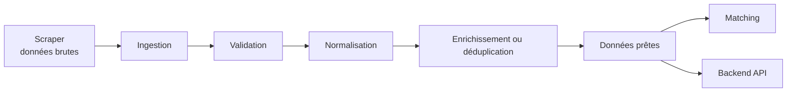

# Pipeline de données

- Dépôt associé : `../pipeline-vapalep`
- Rôle : transformer les données collectées en données cohérentes et exploitables par le matching et l'API.

## Responsabilités

Le pipeline représente l'étape de préparation des données. Il a vocation à :

- recevoir les données issues du scraper ;
- valider leur structure et leur qualité ;
- normaliser les formats et les champs ;
- dédupliquer ou enrichir les enregistrements lorsque nécessaire ;
- produire un format stable pour les composants consommateurs.

## Intérêt dans l'architecture

Le pipeline protège les composants métier contre la variabilité des sources externes. Les règles de qualité et de transformation sont regroupées dans un endroit identifiable, ce qui facilite leur évolution et leur supervision.

La sortie du pipeline constitue un contrat de données interne : le matching et le backend peuvent travailler sur une représentation cohérente plutôt que sur les formats propres à chaque source.

## Lire le code

Pour les étapes de traitement, les formats de données, les stratégies d'exécution et les commandes opératoires, consulter le dépôt [`pipeline-vapalep`](../pipeline-vapalep) lorsqu'il est disponible dans l'organisation locale.
