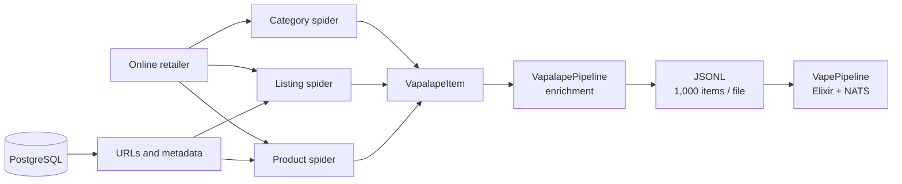

# Multi-retailer Scraper

[Version française](README.md) | **English version**: [README.en.md](README.en.md)

The scraper collects catalogues from French vaping retailers and produces the data consumed by the ingestion pipeline. Each retailer generally has three specialised spiders: categories, listing pages, and product pages.

**Local source repository:** `../scrapy-vapalape`

## Technical stack

| Layer | Technology |
| --- | --- |
| Language | Python |
| Framework | Scrapy 2.16 |
| HTTP | Twisted/asyncio, httpx, curl-cffi |
| Reference database | PostgreSQL through psycopg2 |
| Export | JSON Lines, batches of 1,000 items |
| Anti-blocking | FlareSolverr, ZenRows, ScrapingBee, ScraperAPI, proxies |
| Cache and coordination | Redis |
| Templates | Jinja2 |
| Tests | pytest, HTML fixtures, and spider tests |
| Local orchestration | `runner.py`, just, Scrapyd/ScrapydWeb |

## Architecture



For a retailer named `vendor`, the convention is generally:

```text
{vendor}_categs
{vendor}_list
{vendor}_product
```

Listing and product spiders can load their URLs from PostgreSQL through `DatabasePoolMiddleware`. Categories are traversed in BFS order so `parent_external_id` can be resolved during export.

## Item model

All items inherit from `VapalapeItem`, which provides fields such as `item_type`, `spider`, `track_id`, and `store_id`. Subtypes represent the domain model shared with the API and pipeline:

- `StoreItem`;
- `BrandItem` and `BrandStoreItem`;
- `CategoryItem` and `CategoryAttributeItem`;
- `ProductItem` and `ProductVariantItem`;
- `ProductStoreItem`;
- `PriceItem` and `PriceHistoryItem`;
- `ProductImageItem`, `ProductReviewItem`, and `ScrapingLogItem`.

`VapalapePipeline` enriches items with their type, spider name, retailer, run tracking, and HTTP statuses. Scrapy exporters write UTF-8 JSONL files under `data/<spider>/` in batches of 1,000 items.

## Collection resilience

The project treats retailers as unstable sources:

- global and per-domain concurrency limits;
- download delays and AutoThrottle;
- retries for `429`, `5xx`, and anti-bot responses;
- disabled cookies and browser-like headers;
- a circuit breaker after a series of `4xx` responses;
- HTTP status, retry, backoff, and proxy middleware;
- fallback between FlareSolverr, ScrapingBee, ZenRows, and ScraperAPI;
- proxy rotation and cooldown;
- scraping logs and statuses forwarded to the ingestion pipeline.

Spiders can enable or disable proxy strategies through `custom_settings`, making it possible to adapt the behaviour to each retailer.

## Development

```bash
source venv/bin/activate

just test
python runner.py
scrapy crawl kumulus_categs
```

The project contains scripts to run category, listing, and product crawls, test fixtures, archive logs, inspect PostgreSQL, and manage FlareSolverr services. Targeted tests use pytest, for example:

```bash
pytest -s -vv \
  vapalape/tests/spiders/kumulus/test_kumulus_categs.py
```

## Spider generation and validation

The repository also contains templates, HTML fixtures, category mappings, and an organisation of generation agents. The documented workflow is iterative:

```text
Generate spider
        ↓
Run fixture-based tests
        ↓
Analyse failures
        ↓
Fix or regenerate
        ↓
Crawl and produce QA report
```

This loop reduces the risk of deploying an extractor without validating it against the HTML structures of a specific retailer.

For further details: [`README.md`](../scrapy-vapalape/README.md), [`docs/workflow.md`](../scrapy-vapalape/docs/workflow.md), [`docs/SPIDER_SUPERVISION_AUTO_REPAIR.md`](../scrapy-vapalape/docs/SPIDER_SUPERVISION_AUTO_REPAIR.md), and [`jobs.md`](../scrapy-vapalape/jobs.md).
