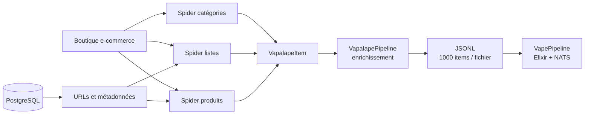

# Scraper multi-boutiques

Le scraper collecte les catalogues de boutiques françaises de vape et produit les données utilisées par le pipeline d'ingestion. Chaque boutique possède généralement trois spiders spécialisés : catégories, listes et fiches produit.

**Code source local :** `../scrapy-vapalape`

## Stack technique

| Couche | Technologie |
| --- | --- |
| Langage | Python |
| Framework | Scrapy 2.16 |
| HTTP | Twisted/asyncio, httpx, curl-cffi |
| Base de référence | PostgreSQL via psycopg2 |
| Export | JSON Lines, batches de 1 000 items |
| Anti-blocage | FlareSolverr, ZenRows, ScrapingBee, ScraperAPI, proxies |
| Cache et coordination | Redis |
| Templates | Jinja2 |
| Tests | pytest, fixtures HTML et tests de spiders |
| Orchestration locale | `runner.py`, just, Scrapyd/ScrapydWeb |

## Architecture



Pour une boutique `vendor`, la convention est généralement :

```text
{vendor}_categs
{vendor}_list
{vendor}_product
```

Les spiders de listes et de produits peuvent charger leurs URLs depuis PostgreSQL via `DatabasePoolMiddleware`. Les catégories sont parcourues en BFS afin que `parent_external_id` puisse être résolu au fil de l'export.

## Modèle d'items

Tous les items héritent de `VapalapeItem`, qui fournit notamment `item_type`, `spider`, `track_id` et `store_id`. Les sous-types représentent le modèle métier partagé avec l'API et le pipeline :

- `StoreItem` ;
- `BrandItem` et `BrandStoreItem` ;
- `CategoryItem` et `CategoryAttributeItem` ;
- `ProductItem` et `ProductVariantItem` ;
- `ProductStoreItem` ;
- `PriceItem` et `PriceHistoryItem` ;
- `ProductImageItem`, `ProductReviewItem` et `ScrapingLogItem`.

`VapalapePipeline` enrichit les items avec leur type, le nom du spider, le magasin, le suivi d'exécution et les statuts HTTP. Les exporters Scrapy écrivent des fichiers JSONL UTF-8 sous `data/<spider>/` par lots de 1 000 éléments.

## Résilience de collecte

Le projet traite les boutiques comme des sources instables :

- concurrence globale et par domaine limitée ;
- délai de téléchargement et AutoThrottle ;
- retries sur `429`, `5xx` et réponses anti-bot ;
- cookies désactivés et en-têtes de navigateur ;
- circuit breaker après une série de réponses `4xx` ;
- middlewares de statut HTTP, retry, backoff et proxy ;
- fallback entre FlareSolverr, ScrapingBee, ZenRows et ScraperAPI ;
- rotation et cooldown de proxies ;
- logs et statuts de scraping transmis au pipeline.

Les spiders peuvent activer ou désactiver les stratégies de proxy dans `custom_settings`, ce qui permet d'adapter le comportement à chaque boutique.

## Développement

```bash
source venv/bin/activate

just test
python runner.py
scrapy crawl kumulus_categs
```

Le projet contient des scripts pour lancer des crawls par catégories, listes ou produits, tester des fixtures, archiver les logs, inspecter PostgreSQL et gérer les services FlareSolverr. Les tests ciblés utilisent pytest, par exemple :

```bash
pytest -s -vv \
  vapalape/tests/spiders/kumulus/test_kumulus_categs.py
```

## Génération et validation des spiders

Le dépôt contient aussi des templates, des fixtures HTML, des mappings de catégories et une organisation d'agents de génération. Le workflow documenté est itératif :

```text
Générer le spider
        ↓
Exécuter les tests sur fixtures
        ↓
Analyser les erreurs
        ↓
Corriger ou régénérer
        ↓
Crawler et rapport QA
```

Cette boucle réduit le risque de déployer un extracteur sans validation sur les structures HTML propres à une boutique.

Pour approfondir : [`README.md`](../scrapy-vapalape/README.md), [`docs/workflow.md`](../scrapy-vapalape/docs/workflow.md), [`docs/SPIDER_SUPERVISION_AUTO_REPAIR.md`](../scrapy-vapalape/docs/SPIDER_SUPERVISION_AUTO_REPAIR.md) et [`jobs.md`](../scrapy-vapalape/jobs.md).
