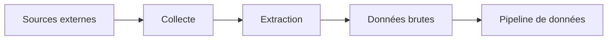

# Scraper

- Dépôt associé : `../scrapy-vapalape`
- Rôle : collecter les données nécessaires à Vapalape depuis des sources externes.

## Responsabilités

Le scraper est la porte d'entrée des données externes. Il a vocation à :

- accéder aux sources configurées ;
- extraire les informations utiles ;
- respecter la structure attendue par le pipeline ;
- gérer les variations de format ou les erreurs de collecte ;
- transmettre des données brutes accompagnées des métadonnées nécessaires au traitement.

## Intérêt dans l'architecture

Le scraper est isolé du reste du produit afin que les changements de sources, de formats ou de stratégies de collecte n'imposent pas de modifier l'API ou l'interface utilisateur.

Le [`pipeline`](../pipeline/README.md) prend ensuite en charge la validation et la normalisation. Cette distinction clarifie la frontière entre acquisition de données et traitement métier.

## Lire le code

Pour les sources ciblées, les extracteurs, les paramètres d'exécution et les commandes de collecte, consulter le dépôt [`scrapy-vapalape`](../scrapy-vapalape) lorsqu'il est disponible dans l'organisation locale.
